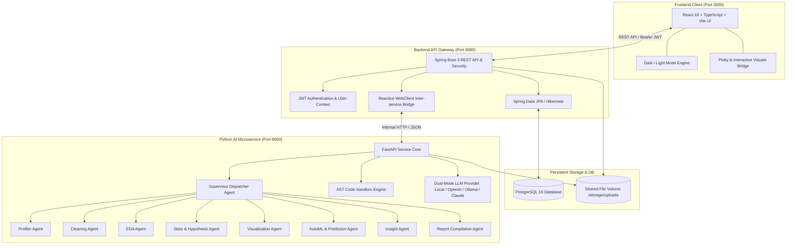
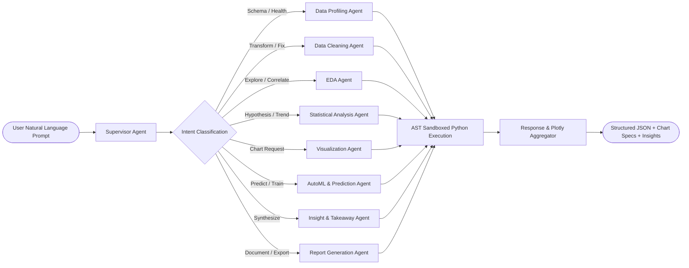

# 🤖 Agentic AI Data Analysis & Visualization Assistant

[](https://www.oracle.com/java/)
[](https://spring.io/projects/spring-boot)
[](https://fastapi.tiangolo.com/)
[](https://www.python.org/)
[](https://reactjs.org/)
[](https://www.typescriptlang.org/)
[](https://vitejs.dev/)
[](https://tailwindcss.com/)
[](https://www.postgresql.org/)
[](https://www.docker.com/)
[](LICENSE)

An enterprise-grade, full-stack **Autonomous Agentic AI Data Analyst & Visualization Platform**. Users upload structured tabular datasets (CSV / Excel) and seamlessly interact with their data using natural language. The system orchestrates a hierarchy of specialized AI agents to autonomously profile data health, execute intelligent cleaning pipelines, run exploratory data analysis (EDA), perform hypothesis testing, build machine learning models, render dynamic Plotly visualizations, and compile executive intelligence reports.

---

## 📑 Table of Contents

1. [Key Capabilities & Modules](#-key-capabilities--modules)
2. [System Architecture](#-system-architecture)
3. [Multi-Agent Hierarchy](#-multi-agent-hierarchy)
4. [Mathematical & Statistical Foundations](#-mathematical--statistical-foundations)
5. [Security & AST Code Execution Sandbox](#-security--ast-code-execution-sandbox)
6. [Project Monorepo Structure](#-project-monorepo-structure)
7. [API Endpoints Reference](#-api-endpoints-reference)
8. [Configuration & Environment Variables](#-configuration--environment-variables)
9. [Getting Started & Local Setup](#-getting-started--local-setup)
   - [Option A: Docker Compose (Recommended)](#option-a-docker-compose-one-click-launch)
   - [Option B: Local Bare-Metal Development](#option-b-local-bare-metal-step-by-step)
10. [Sample Datasets & Example Prompts](#-sample-datasets--example-prompts)
11. [Testing & Quality Assurance](#-testing--quality-assurance)
12. [License & Acknowledgments](#-license--acknowledgments)

---

## ✨ Key Capabilities & Modules

| Workspace / Module | Core Functionality | Technologies |
| :--- | :--- | :--- |
| **📊 Executive Dashboard** | High-level dataset metrics, overall quality health gauge, automated KPI summaries, distribution quick-glance, and top strategic insights. | React, Tailwind, Lucide, Recharts / Plotly |
| **📁 Dataset Studio** | Upload CSV/XLSX (up to 50MB), auto-detect data schema, preview records, track versions, and manage persistent dataset metadata. | Spring Boot, JPA, PostgreSQL, Pandas |
| **💬 Agentic Natural Language Chat** | Conversational data exploration, automatic intent resolution, dynamic chart generation (Column, Line, Pie, Viridis Maps), and full chat transcript download (.MD/.JSON) and printing. | Supervisor Agent, AST Sandbox, LLM Provider, Plotly |
| **🔬 Automated EDA Studio** | Univariate & bivariate analysis, distribution skewness/kurtosis, correlation heatmaps, missing value matrices, and outliers. | EDA Agent, SciPy, NumPy, Plotly |
| **🧹 Smart Data Cleaning** | Automated and interactive missing value imputation, IQR-based outlier clipping, deduplication, type casting, and one-hot encoding. | Cleaning Agent, Pandas, Scikit-Learn |
| **🤖 AutoML & Prediction Lab** | Automatic problem detection (Regression, Classification, Clustering, Anomaly Detection), hyperparameter tuning, model training, evaluation, and live inference. | ML Agent, Scikit-Learn, XGBoost |
| **⚖️ Multi-Dataset Comparison** | Cross-dataset structural comparison, statistical divergence, schema alignment, and performance benchmarking. | FastApi Compare Router, Pandas |
| **📑 Executive Intelligence Reports** | Instant generation of professional audit reports, summary statistics, strategic action plans, and exportable Markdown/PDF documents. | Report Agent, Plotly, ReportLab |

---

## 🏛️ System Architecture



---

## 🧠 Multi-Agent Hierarchy

The analytical backend utilizes an autonomous multi-agent architecture where the **Supervisor Agent** coordinates specialized sub-agents based on the user's intent and dataset properties:



### Agent Roles & Responsibilities

1. **Supervisor Agent (`agents/supervisor.py`)**:
   - Parses user prompts, extracts semantic intent, inspects column headers, generates safe Pandas code snippets, and routes sub-tasks.
2. **Data Profiling Agent (`agents/profiler_agent.py`)**:
   - Calculates statistical distributions, null percentage matrices, duplicate rates, cardinality ratios, and computes the 0–100 Data Health Score.
3. **Data Cleaning Agent (`agents/cleaning_agent.py`)**:
   - Executes deterministic cleaning operations: mean/median/mode imputation, IQR boundary clipping, categorical normalization, and datatype correction.
4. **EDA Agent (`agents/eda_agent.py`)**:
   - Computes univariate skewness, kurtosis, frequency breakdowns, bivariate correlation matrices, and automated outlier detection.
5. **Statistical Analysis Agent (`agents/stats_agent.py`)**:
   - Performs two-sample independent/paired T-Tests, One-Way ANOVA, Chi-Square tests of independence, Pearson $r$, Spearman $\rho$, and ordinary least squares (OLS) linear trends.
6. **Visualization Agent (`agents/viz_agent.py`)**:
   - Constructs responsive Plotly JSON chart specifications across **Column Charts**, **Line Graphs**, **Pie & Donut Charts**, **Geographic Maps** (Scattergeo & Choropleth for lat/lon and country/state coordinates), Bar Charts, Scatter Plots, Box Plots, Histograms, and Correlation Heatmaps.
7. **AutoML & Prediction Agent (`agents/ml_agent.py`)**:
   - Automatically selects high-accuracy models (**Gradient Boosting**, Random Forest, Logistic/Linear Regression, Ridge, K-Means, Isolation Forest), performs 5-fold cross-validation, feature scaling, missing value imputation, feature importance extraction, and live prediction serving.
8. **Insight Generation Agent (`agents/insight_agent.py`)**:
   - Identifies high-leverage drivers, anomalies, revenue correlations, and operational takeaways in structured executive prose.
9. **Report Compilation Agent (`agents/report_agent.py`)**:
   - Compiles comprehensive Markdown and PDF data intelligence audits containing executive summaries, quality scorecards, and strategy roadmaps.

---

## 📊 Mathematical & Statistical Foundations

The system uses mathematically sound statistical algorithms and machine learning evaluation criteria:

### 1. Data Quality & Health Score ($0 - 100$, Grades A+ to F)
$$\text{Quality Score} = 0.40 \times \text{Completeness} + 0.30 \times \text{Uniqueness} + 0.20 \times \text{Validity} + 0.10 \times \text{Consistency}$$

- **Completeness**:
  $$\text{Completeness} = 1 - \left( \frac{\sum \text{Null Cells}}{\text{Total Rows} \times \text{Total Columns}} \right)$$
- **Uniqueness**:
  $$\text{Uniqueness} = 1 - \left( \frac{\text{Duplicate Rows}}{\text{Total Rows}} \right)$$
- **Validity**:
  $$\text{Validity} = \frac{\sum_{i=1}^{n} \mathbb{I}(Q_1 - 1.5\text{IQR} \le x_i \le Q_3 + 1.5\text{IQR})}{n}$$

---

### 2. Machine Learning Evaluation Metrics

#### Supervised Regression:
- **$R^2$ Score (Coefficient of Determination)**:
  $$R^2 = 1 - \frac{\sum_{i=1}^n (y_i - \hat{y}_i)^2}{\sum_{i=1}^n (y_i - \bar{y})^2}$$
- **Root Mean Squared Error (RMSE)**:
  $$\text{RMSE} = \sqrt{\frac{1}{n} \sum_{i=1}^n (y_i - \hat{y}_i)^2}$$
- **Mean Absolute Error (MAE)**:
  $$\text{MAE} = \frac{1}{n} \sum_{i=1}^n |y_i - \hat{y}_i|$$

#### Supervised Classification:
- **Accuracy**:
  $$\text{Accuracy} = \frac{TP + TN}{TP + TN + FP + FN}$$
- **Precision & Recall**:
  $$\text{Precision} = \frac{TP}{TP + FP}, \quad \text{Recall} = \frac{TP}{TP + FN}$$
- **$F_1$-Score**:
  $$F_1 = 2 \times \frac{\text{Precision} \times \text{Recall}}{\text{Precision} + \text{Recall}}$$
- **ROC-AUC**: Integrated Area Under the True Positive Rate vs. False Positive Rate curve.

#### Unsupervised Clustering & Anomaly Detection:
- **Silhouette Coefficient**:
  $$s(i) = \frac{b(i) - a(i)}{\max(a(i), b(i))}$$
- **Isolation Forest Outlier Score**: Evaluates path length $h(x)$ across an ensemble of randomized trees.

---

### 3. Hypothesis Testing & Diagnostics
- **Student's Two-Sample $t$-test**:
  $$t = \frac{\bar{x}_1 - \bar{x}_2}{\sqrt{\frac{s_1^2}{n_1} + \frac{s_2^2}{n_2}}}$$
- **One-Way ANOVA ($F$-statistic)**:
  $$F = \frac{\text{Between-Group Variance (MSB)}}{\text{Within-Group Variance (MSW)}}$$
- **Pearson Linear Correlation ($r$)**:
  $$r = \frac{\sum (x_i - \bar{x})(y_i - \bar{y})}{\sqrt{\sum (x_i - \bar{x})^2 \sum (y_i - \bar{y})^2}}$$

---

## 🔒 Security & AST Code Execution Sandbox

To guarantee zero remote code execution (RCE) risk, all agent-generated Python code runs inside a deterministic **Abstract Syntax Tree (AST) Sandbox**:

```
[Agent Generated Code] ──► [AST Parser] ──► [Node & Call Whitelist Validation]
                                                      │
                       ┌──────────────────────────────┴──────────────────────────────┐
                       ▼                                                             ▼
             [Forbidden Syntax Detected]                                   [Passed Validation]
             - 'eval', 'exec', 'open'                                      - Restricted builtins only
             - 'os', 'sys', 'subprocess'                                   - Time Guard: 10s timeout
             - '__class__', '__subclasses__'                               - Memory limit protection
                       │                                                             │
                       ▼                                                             ▼
            [Safe Heuristic Fallback]                                     [Execute on DataFrame]
```

### Key Security Safeguards:
1. **AST Token Validation**: Parses code into Python AST nodes (`ast.parse`) before execution. Blocks imports, file system access, reflection dunder attributes (`__subclasses__`, `__globals__`), and shell executions.
2. **Deterministic Time Guards**: Queries timeout strictly at **10 seconds** to avoid infinite loops or denial of service.
3. **Spring Security Layer**: Stateless JWT authentication, PBKDF2 / BCrypt credential hashing, CORS whitelist protection, and multipart upload size caps ($50\text{MB}$).

---

## 📁 Project Monorepo Structure

```
Agentic AI Data Analysis System/
├── .env.example                     # Environment configuration template
├── .gitignore                       # Polyglot gitignore (Python, Java, Node, Docker)
├── docker-compose.yml               # Multi-container orchestration specification
├── README.md                        # Documentation & setup guide
├── Executive_Data_Intelligence_Report.md  # Sample generated report
│
├── ai-service/                      # Python 3.10+ FastAPI AI Microservice
│   ├── Dockerfile                   # Production Python Dockerfile
│   ├── requirements.txt             # Python dependencies (FastAPI, Scikit-Learn, Plotly, etc.)
│   ├── app.py                       # FastAPI entrypoint & middleware configuration
│   ├── config.py                    # Environment settings & LLM provider toggles
│   ├── agents/                      # Specialized AI agent implementations
│   │   ├── supervisor.py            # Primary orchestrator & dispatcher agent
│   │   ├── profiler_agent.py        # Data health & statistical profiler
│   │   ├── cleaning_agent.py        # Imputation, outlier & type cleaning
│   │   ├── eda_agent.py             # Univariate & bivariate exploratory analysis
│   │   ├── stats_agent.py           # Hypothesis testing & regression trends
│   │   ├── viz_agent.py             # Plotly dynamic chart builder
│   │   ├── ml_agent.py              # AutoML, models, metrics & inference
│   │   ├── insight_agent.py         # Key finding & driver extractor
│   │   └── report_agent.py          # Markdown/PDF intelligence compiler
│   ├── routers/                     # FastAPI endpoint route controllers
│   ├── sandbox/                     # AST safe code parser & execution sandbox
│   ├── services/                    # LLM providers (Local, OpenAI, Claude, Ollama)
│   └── tests/                       # Pytest test suite
│
├── backend/                         # Spring Boot 3 Backend Gateway (Java 21)
│   ├── Dockerfile                   # Multi-stage Maven build Dockerfile
│   ├── pom.xml                      # Maven dependencies (Security, JPA, WebFlux, JWT)
│   └── src/
│       ├── main/
│       │   ├── java/com/agentic/ai/ # Core Spring Boot application packages
│       │   │   ├── controller/      # REST API Controllers (Auth, Dataset, Chat, ML, etc.)
│       │   │   ├── service/         # Business logic & FastAPI WebClient integrations
│       │   │   ├── entity/          # JPA database entities (User, Dataset, Analysis)
│       │   │   ├── repository/      # Spring Data JPA repositories
│       │   │   ├── security/        # JWT filter & Spring Security configuration
│       │   │   └── dto/             # Request / Response Data Transfer Objects
│       │   └── resources/
│       │       ├── application.yml  # Spring Boot configuration
│       │       └── schema.sql       # Database schema initialization script
│       └── test/                    # JUnit 5 & Mockito test suite
│
├── frontend/                        # React 18 + TypeScript + Vite UI
│   ├── Dockerfile                   # Production NGINX web server Dockerfile
│   ├── package.json                 # Node dependencies & build scripts
│   ├── vite.config.ts               # Vite bundler configuration
│   ├── tailwind.config.js           # Tailwind CSS theme configuration
│   └── src/
│       ├── App.tsx                  # Root application router & workspace switcher
│       ├── components/              # Reusable UI components (Navbar, Chart, Tables)
│       ├── pages/                   # Main workspaces
│       │   ├── DashboardPage.tsx    # Executive overview & dataset metrics
│       │   ├── DatasetStudioPage.tsx# File upload & data previewer
│       │   ├── ChatPage.tsx         # Agentic natural language chat interface
│       │   ├── EDAPage.tsx          # Automated Exploratory Data Analysis
│       │   ├── CleaningPage.tsx     # Smart data cleaning & transformations
│       │   ├── MLPage.tsx           # AutoML model training & live inference
│       │   ├── ComparisonPage.tsx   # Cross-dataset comparative analytics
│       │   └── ReportsPage.tsx      # Executive intelligence report generator
│       ├── services/                # Axios / Fetch API client layer
│       └── types/                   # TypeScript interfaces and contracts
│
├── sample-datasets/                 # Production-ready datasets for immediate testing
│   ├── sales_data_2025.csv          # Revenue, Ad Spend, Regional Sales
│   ├── customer_churn.csv           # Telecommunication churn & demographics
│   ├── housing_prices.csv           # Real estate pricing with missing values/outliers
│   └── marketing_campaign.csv       # Multi-channel campaign ROI & conversions
│
└── Outputs/                         # Exported sample analytical outputs & PDFs
```

---

## 🔌 API Endpoints Reference

### Spring Boot Backend API (`http://localhost:8080`)

| Method | Endpoint | Description | Auth Required |
| :--- | :--- | :--- | :--- |
| `POST` | `/api/v1/auth/register` | Register a new user account | ❌ No |
| `POST` | `/api/v1/auth/login` | Authenticate and obtain JWT Bearer Token | ❌ No |
| `GET` | `/api/v1/datasets` | List all uploaded datasets for current user | ✅ Yes |
| `POST` | `/api/v1/datasets/upload` | Upload CSV or Excel file (`multipart/form-data`) | ✅ Yes |
| `GET` | `/api/v1/datasets/{id}` | Retrieve complete dataset details and profile | ✅ Yes |
| `DELETE` | `/api/v1/datasets/{id}` | Delete dataset and its associated file storage | ✅ Yes |
| `POST` | `/api/v1/chat/query` | Send natural language analytical query to Agent | ✅ Yes |
| `POST` | `/api/v1/analysis/eda` | Trigger automated exploratory data analysis | ✅ Yes |
| `POST` | `/api/v1/analysis/clean` | Apply automated or custom cleaning pipeline | ✅ Yes |
| `POST` | `/api/v1/ml/train` | Train AutoML predictive regression/classification | ✅ Yes |
| `POST` | `/api/v1/ml/predict` | Run live inference on a trained machine learning model | ✅ Yes |
| `POST` | `/api/v1/reports/generate` | Generate full executive intelligence report | ✅ Yes |
| `GET` | `/api/v1/health` | Service health status & database connectivity check | ❌ No |

### FastAPI AI Microservice (`http://localhost:8000`)

| Method | Endpoint | Description |
| :--- | :--- | :--- |
| `POST` | `/api/v1/profile` | Computes column statistical profiles and quality health scores |
| `POST` | `/api/v1/clean` | Executes dataset transformations, imputation, and IQR clipping |
| `POST` | `/api/v1/eda` | Generates correlation matrices, distributions, and skewness |
| `POST` | `/api/v1/query` | Supervisor Agent natural language query processor & AST sandbox |
| `POST` | `/api/v1/ml/train` | Trains scikit-learn/XGBoost models and computes metrics |
| `POST` | `/api/v1/ml/predict` | Executes prediction inference on arbitrary feature inputs |
| `POST` | `/api/v1/compare` | Compares two distinct datasets and computes divergence |
| `POST` | `/api/v1/reports/generate`| Compiles Markdown / HTML / PDF executive reports |
| `GET` | `/docs` | Interactive Swagger UI API documentation |

---

## ⚙️ Configuration & Environment Variables

Copy `.env.example` to create your local `.env` file:

```bash
cp .env.example .env
```

| Variable | Default Value | Description |
| :--- | :--- | :--- |
| `SPRING_DATASOURCE_URL` | `jdbc:postgresql://localhost:5432/agentic_data_db` | PostgreSQL JDBC connection URL |
| `SPRING_DATASOURCE_USERNAME` | `postgres` | PostgreSQL username |
| `SPRING_DATASOURCE_PASSWORD` | `postgres` (or `postgrespassword` in Docker) | PostgreSQL password |
| `JWT_SECRET` | `404E635266...` | 256-bit secret key for JWT token signing |
| `JWT_EXPIRATION_MS` | `86400000` (24 Hours) | JWT token lifespan in milliseconds |
| `FASTAPI_BASE_URL` | `http://localhost:8000` | FastAPI internal microservice URL |
| `STORAGE_UPLOAD_DIR` | `./storage/uploads` | Path to dataset upload directory |
| `LLM_PROVIDER` | `local` | LLM Mode: `local` (offline heuristic), `openai`, `ollama`, `anthropic` |
| `OPENAI_API_KEY` | `""` | OpenAI API Key (required only if `LLM_PROVIDER=openai`) |
| `OPENAI_MODEL` | `gpt-4o-mini` | OpenAI Model selection (`gpt-4o`, `gpt-4o-mini`) |
| `ANTHROPIC_API_KEY` | `""` | Anthropic API Key (required if `LLM_PROVIDER=anthropic`) |
| `OLLAMA_BASE_URL` | `http://localhost:11434` | Ollama service URL (required if `LLM_PROVIDER=ollama`) |
| `MAX_FILE_SIZE_MB` | `50` | Maximum file upload limit in megabytes |
| `SANDBOX_TIMEOUT_SECONDS` | `10` | Maximum timeout for AST Python execution |

> [!NOTE]
> **Zero External Dependency Mode**: By default, `LLM_PROVIDER=local`. The system functions **100% offline** without needing any paid API keys using its intelligent rule-based heuristic code synthesis and deterministic statistical engine.

---

## 🚀 Getting Started & Local Setup

### Prerequisites
- **Node.js**: 18.x or later with `npm`
- **Python**: 3.10 or later with `pip`
- **Java Development Kit (JDK)**: Java 21 (Temurin, OpenJDK, or Oracle)
- **Maven**: 3.8+ (or use the included `./mvnw`)
- **Docker & Docker Compose** (Optional, for containerized run)

---

### Option A: Docker Compose (One-Click Launch)

To launch the complete infrastructure (PostgreSQL + FastAPI + Spring Boot + React Frontend):

```bash
# 1. Clone the repository and enter the directory
cd "Agentic AI Data Analysis System"

# 2. Build and start all 4 services
docker-compose up --build
```

#### Access Points:
- 🌐 **Frontend Web Application**: [http://localhost:3000](http://localhost:3000)
- ☕ **Spring Boot API Gateway**: [http://localhost:8080](http://localhost:8080)
- 🐍 **FastAPI Interactive Docs**: [http://localhost:8000/docs](http://localhost:8000/docs)
- 🐘 **PostgreSQL Instance**: `localhost:5432` (`db: agentic_data_db`, `user: postgres`)

---

### Option B: Local Bare-Metal (Step-by-Step)

If you prefer running services directly in separate terminal windows:

#### 1. Setup & Start PostgreSQL
Ensure PostgreSQL is running locally on port 5432 with database `agentic_data_db`:
```sql
CREATE DATABASE agentic_data_db;
```

#### 2. Start the Python FastAPI AI Microservice
```bash
cd ai-service

# Create and activate virtual environment
python -m venv venv
# On Windows:
venv\Scripts\activate
# On Linux/macOS:
source venv/bin/activate

# Install dependencies
pip install -r requirements.txt

# Run the FastAPI server
python -m uvicorn app:app --host 0.0.0.0 --port 8000 --reload
```

#### 3. Start the Spring Boot Backend Gateway
```bash
cd backend

# Build and run with Maven (Java 21)
mvn spring-boot:run
```

#### 4. Start the React Frontend Application
```bash
cd frontend

# Install Node dependencies
npm install

# Start Vite development server
npm run dev
```
Open your browser at [http://localhost:5173](http://localhost:5173) (or [http://localhost:3000](http://localhost:3000)).

---

## 📂 Sample Datasets & Example Prompts

Four pre-loaded datasets are included in `sample-datasets/` for immediate exploration:

### 1. `sales_data_2025.csv`
- **Domain**: Retail & Commercial Operations
- **Columns**: `Month`, `Region`, `Units_Sold`, `Advertising_Spend`, `Discount_Rate`, `Revenue`
- **Example Prompts to Try**:
  - *"What is the total revenue by region?"*
  - *"Show a scatter plot of Advertising Spend vs Revenue with a trendline."*
  - *"What is the correlation between Discount Rate and Units Sold?"*

### 2. `customer_churn.csv`
- **Domain**: Telecom Customer Retention
- **Columns**: `CustomerID`, `Age`, `Tenure_Months`, `Contract_Type`, `Monthly_Charges`, `Support_Calls`, `Churn`
- **Example Prompts to Try**:
  - *"What is the churn rate by Contract Type?"*
  - *"Train a classification model predicting Churn based on Monthly Charges and Support Calls."*
  - *"Show a boxplot of Monthly Charges across Churned vs Non-Churned customers."*

### 3. `housing_prices.csv`
- **Domain**: Real Estate Valuation (Contains intentional missing values & outliers)
- **Columns**: `Square_Footage`, `Bedrooms`, `Bathrooms`, `Year_Built`, `Neighborhood_Rating`, `Price`
- **Example Prompts to Try**:
  - *"Profile the missing values in this dataset."*
  - *"Clean missing values using median imputation and remove price outliers."*
  - *"Train a Random Forest regression model to predict housing Price."*

### 4. `marketing_campaign.csv`
- **Domain**: Digital Advertising Performance
- **Columns**: `Campaign_ID`, `Channel`, `Impressions`, `Clicks`, `Conversions`, `Spend`, `ROI`
- **Example Prompts to Try**:
  - *"Which advertising channel yielded the highest ROI?"*
  - *"Compare conversion rates across channels using a bar chart."*

---

## 🧪 Testing & Quality Assurance

### Python AI Service Test Suite
```bash
cd ai-service
pytest tests/ -v
```

### Spring Boot Backend Test Suite
```bash
cd backend
mvn test
```

### Frontend TypeScript & Lint Verification
```bash
cd frontend
npm run build
```

---

## 📄 License & Acknowledgments

This project is licensed under the **MIT License**.

Built for enterprise-grade autonomous data intelligence and AI-powered analytical decision support.
